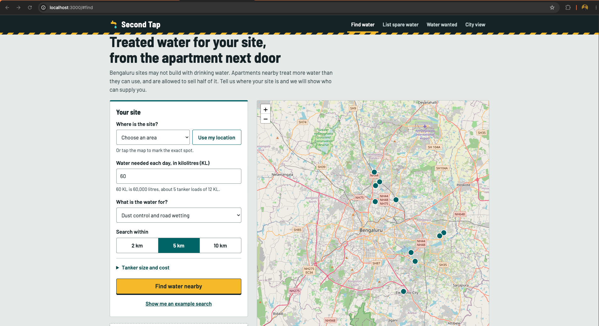
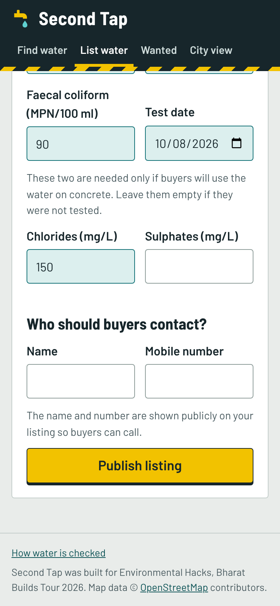
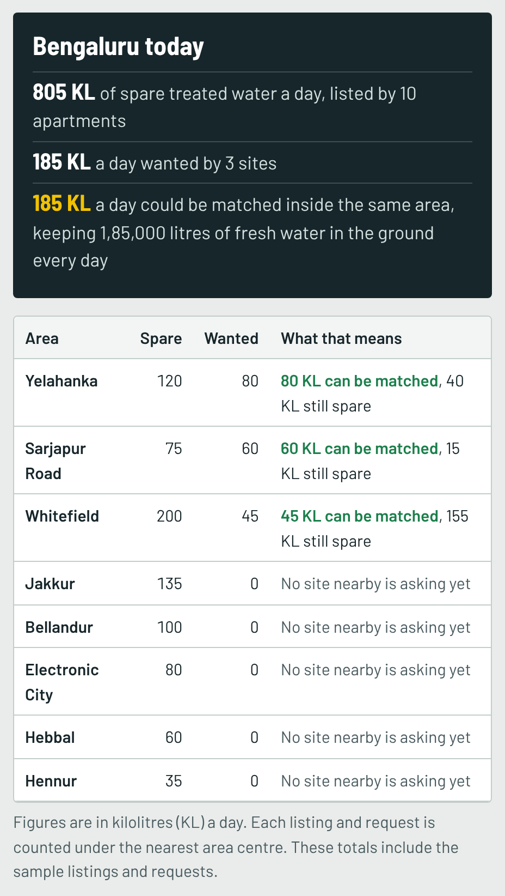
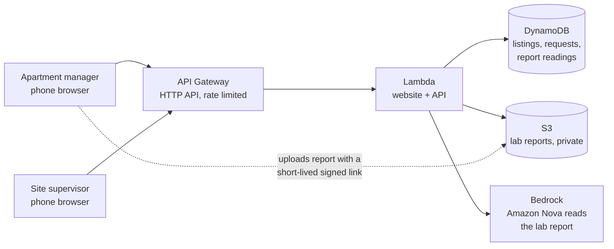

# Second Tap

**Treated water for construction sites, from the apartment next door.**

Built for Environmental Hacks (Bharat Builds Tour 2026), Track 02: Heat and Water.

- **Runs on:** AWS SAM (open source), locally. See "Run it as a real Lambda function" below.
- **Demo video:** _add your YouTube link here_



## The problem

- Bengaluru has thousands of apartment sewage treatment plants. Since 2024 apartments
  may sell half of their treated water, but almost none manage to: there is no way
  for a buyer to find them, and buyers do not trust the quality.
- Construction sites are not allowed to build with drinking water, and struggle to
  find treated water. Many fall back on tankers filled from borewells.
- So treated water goes down the drain while groundwater is pumped a few streets away.

Second Tap matches the two. Every kilolitre matched is a kilolitre of groundwater
left in the ground.

## What it does

**For an apartment**

1. Upload the latest lab report. An AI model on Amazon Bedrock reads the values and
   fills in the form.
2. Publish the listing: location, spare kilolitres a day, price.
3. Get a private link to update, pause or delete the listing. No account or password.
4. See which construction sites nearby are already asking for water.

**For a construction site**

1. Say where the site is, how much water it needs and what for (dust control,
   washing, landscaping, concrete curing or mixing).
2. See nearby apartments ranked by suitability and distance. Each one shows:
   - a result for that exact use, *Fit*, *Check first* or *Not suitable*, with the reason
   - whether the seller's numbers match the attached lab report
   - how much of the need it covers, and an estimated daily cost
   - Call and WhatsApp buttons, and the lab report itself
3. Get a **suggested order**: how much to take from which apartments to cover the
   whole need at low cost.
4. Post the request publicly, so apartments can call the site. It closes after
   30 days, or sooner from the site's private link.

**For the city**

The **City view** puts every listing and every request on one map and adds them
up area by area, showing where matching, or a short pipeline, would save the most
fresh water.

| The form fills itself in from the lab report | Supply and demand, area by area |
| --- | --- |
|  |  |

## Try it in two minutes

1. Open the site and choose **Show me an example search**. A site in Jakkur asks
   for 150 KL a day for dust control.
2. Three sample apartments can supply it. The **suggested order** takes 120 KL by
   pipeline from one and 30 KL by tanker from another, for ₹4,080 a day. That is
   150,000 litres of fresh water a day that does not come from a borewell.
3. One apartment is marked **Not suitable**. Open its lab values to see which
   limits it fails.
4. Open **List spare water**, upload a lab report and watch the numbers fill in.
   Change one number before publishing, and buyers are told it no longer matches
   the report.

## Run it on your laptop (no AWS account needed)

You need [Node.js](https://nodejs.org) version 20 or newer. Nothing to install.

```bash
cd app
npm start
```

Open http://localhost:3000. Ten sample listings and three sample requests load
automatically. Data is saved in a `.local` folder in the project root; delete it to
start fresh.

The AI report reader needs Amazon Bedrock, so on a laptop the report is attached
and you type the numbers. Everything else works the same.

Run the tests (27 of them; GitHub also runs them on every push):

```bash
cd app
npm test
```

## Run it as a real Lambda function with AWS SAM (no AWS account needed)

[AWS SAM](https://github.com/aws/aws-sam-cli) is an AWS open-source tool. It runs
the same Lambda function on your own computer, inside AWS's Lambda runtime image.
You need Docker Desktop and the SAM CLI installed.

```bash
sam build -t template.local.yaml
sam local start-api --port 3000 --warm-containers LAZY --skip-pull-image
```

Leave that running. In a second terminal, load the samples:

```bash
curl -X POST http://localhost:3000/api/seed
```

Then open http://localhost:3000. Every page request shows up in the first terminal
as a Lambda invocation. Data lives inside the container, so it resets when you stop
the command. The very first run needs the image, so leave out `--skip-pull-image`
that one time.

This is how the demo video was recorded.

## Put it on AWS

`template.yaml` describes the full cloud version: Lambda, API Gateway, DynamoDB,
S3 and Bedrock. Follow **[AWS_SETUP.md](AWS_SETUP.md)**; in short, `sam build && sam deploy`.

The cloud version has not been deployed yet. The AWS account opened for this
hackathon was still not activated at submission time, so the project was built and
demonstrated locally with AWS SAM. The DynamoDB code was tested against a local
DynamoDB emulator, and the Bedrock code against a stand-in server.

## How AWS is used

Built and run with **AWS SAM** (open source). The table shows what each AWS
service does in the cloud version described by `template.yaml`.

| Service | Job |
| --- | --- |
| AWS Lambda | Runs the website and the API (one function, Node.js 22) |
| Amazon API Gateway (HTTP API) | Gives the function a public https address, with rate limits |
| Amazon DynamoDB | Stores listings, requests and report readings. Its time-to-live feature removes requests after 30 days |
| Amazon S3 | Stores lab report files privately. The browser uploads with short-lived signed links |
| Amazon Bedrock (Amazon Nova) | Reads the values from an uploaded lab report (PDF or photo) |
| AWS SAM (open source) | Describes and deploys all of the above from `template.yaml` |



One Lambda function serves both the website and the API, so there is a single
address and nothing to keep in sync. The browser uploads lab reports straight to
S3, so large files never pass through the function.

## Project layout

```
.github/workflows/   Runs the tests on every push
docs/screenshots/    Pictures used in this README
template.yaml        Everything on AWS, described in one file
template.local.yaml  The same function, run locally with AWS SAM
samconfig.toml       Saved settings for "sam deploy"
app/
  server.js          Runs the app on your laptop
  src/
    handler.js       Lambda entry point: serves the website and the API
    api.js           The API routes
    matching.js      Distance, cost, ranking and the suggested order
    quality.js       The water quality limits and the Fit / Check / Not suitable logic
    reader.js        Reads lab reports with Amazon Bedrock, and compares them with typed numbers
    tokens.js        Private links for managing a listing or request
    validate.js      Checks everything users type in
    store.js         DynamoDB on AWS, a JSON file on your laptop
    files.js         S3 on AWS, a local folder on your laptop
    seed-data.js     The sample listings and requests
  public/            The website (plain HTML, CSS and JavaScript)
  test/              Automated tests
```

## How the quality check works

Each listing's lab values are compared with published limits:

- **Every use**: pH 5.5 to 9.0, BOD at most 10 mg/L, COD at most 50 mg/L, suspended
  solids at most 20 mg/L, faecal coliform at most 230 MPN/100 ml. These are the limits
  from the National Green Tribunal order of 30 April 2019 on treated sewage.
- **Concrete curing and mixing** also need pH at least 6, chlorides at most 500 mg/L
  and sulphates at most 400 mg/L, from IS 456:2000.
- A report older than 90 days counts as out of date. This is our own rule.
- Concrete mixing never gets better than *Check first*, because IS 456 also asks for
  strength and setting-time tests that numbers alone cannot replace.
- If the numbers a seller typed disagree with the attached lab report, the listing
  says so and cannot show *Fit*.

This is a screening guide to save phone calls. It is not a lab certificate.
**Before relying on these limits, confirm them against the current KSPCB consent
conditions and the IS 456 text.**

## How it is protected

- **Private links instead of passwords.** Only a fingerprint of each link is stored,
  so the link cannot be rebuilt from the database.
- **Every input is checked on the server**, and the website inserts all text as
  text, so a listing name cannot run code in someone's browser.
- **Lab reports are private.** Buyers get a link that works for five minutes.
- **Uploads are limited** to PDF, JPG and PNG up to 5 MB, and checked after upload.
- **Spending is capped**: the API is rate-limited, the AI reads at most 200 reports
  a day, and the database refuses new records past a ceiling.

## Known limits

- **The AI reader has not run against real Amazon Bedrock yet.** Its code was tested
  against a stand-in server. If Bedrock is unavailable the app falls back to typing.
  The AI can also misread a blurred photo, which is why sellers are asked to check.
- **A matching report is not proof.** It shows the typed numbers agree with the
  uploaded file. It does not prove the file is a real lab's report.
- **Sample data.** The starting listings and requests are invented and marked "Sample".
- **Anyone can post.** There is no identity check on who publishes a listing.
- **Straight-line distance.** Road distance is longer.
- **Matching reads every listing.** Fine for hundreds; a city-wide version would
  index listings by location.
- **English only.** Kannada and Hindi would matter for real site supervisors.

## Credits

- [Leaflet](https://leafletjs.com) map library, BSD 2-Clause licence (`app/public/vendor`)
- [Barlow](https://github.com/jpt/barlow) typeface, SIL Open Font Licence (`app/public/vendor/fonts`)
- Map tiles and data © [OpenStreetMap](https://www.openstreetmap.org/copyright) contributors
- [AWS SDK for JavaScript](https://github.com/aws/aws-sdk-js-v3), Apache 2.0 licence
- AI coding tools used: Claude (Anthropic)

## Sources for the problem

- Citizen Matters, 28 Sep 2026: [Bengaluru's apartment STPs: how wastewater can transform into a vital resource](https://citizenmatters.in/bengalurus-apartment-stps-are-treating-water-no-one-wants-or-can-buy/)
- Deccan Herald: [Despite govt push, few apartments able to sell treated water](https://www.deccanherald.com/amp/story/india%2Fkarnataka%2Fbengaluru%2Fdespite-govt-push-few-apartments-able-to-sell-treated-water-3524496)
- The Hindu, 3 Apr 2024: [BWSSB to supply treated water for construction projects](https://www.pressreader.com/india/the-hindu-bangalore-9WW1/20240403/281651080121605)
- Business Standard, 3 May 2019: [NGT orders stricter norms for effluent discharge from sewage treatment plants](https://www.business-standard.com/article/pti-stories/ngt-orders-stricter-norms-for-effluent-discharge-from-sewage-treatment-plants-119050301041_1.html)